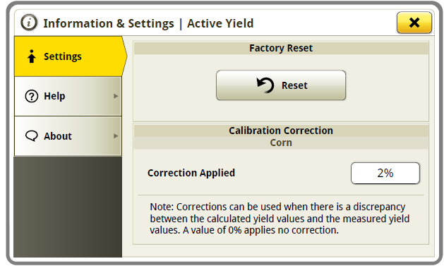

# Effacement des poids de calibrage – S700 - Console 4600

Les calibrages peuvent être réinitialisés aux paramètres d'usine. Cela signifie que toutes les charges
de calibrage précédentes peuvent être supprimées.

La réinitialisation des valeurs d'usine est possible uniquement lorsque **ActiveYield** est activé.

