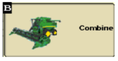
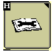
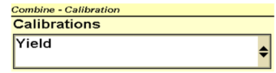
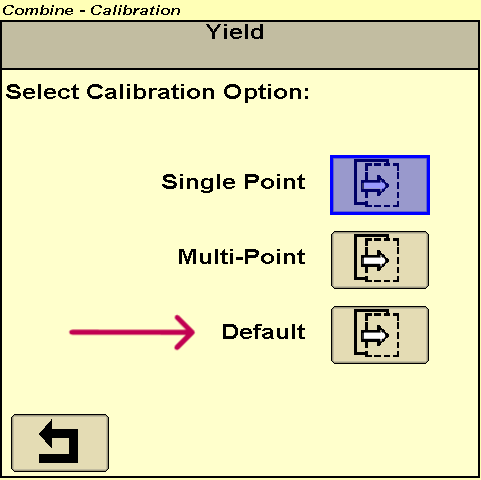

# Effacement des poids de calibrage – S600 - Console 2630

1. Depuis l’écran principal de la console 2630, appuyez sur l’icône **Combine** (B). 
1. Appuyez sur l’icône **Clé à molette** (H). 
1. Dans le menu "Calibration", appuyez sur le menu déroulant et sélectionnez **Yield**. 
1. Appuyez sur l’icône avec un poids suspendu. 
1. Une fois dans le menu de gestion des charges de calibrage, recherchez et sélectionnez l'icône **Default**. 
    
    

1. Valider l’action et les charges de calibrages seront effacées. 

