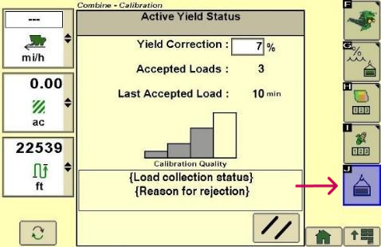
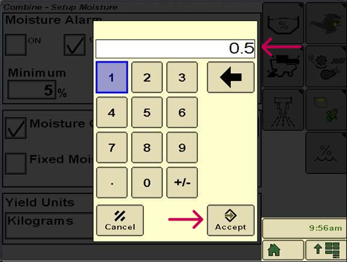

# Facteur de correction d'ActiveYield – S600 - 2630

1. Pour saisir la valeur de correction, appuyer sur le bouton **J**.

    

2. Saisir le décalage entre la valeur réelle mesurée et la valeur donnée par la machine.

3. Sélectionner **Accept**.

    
