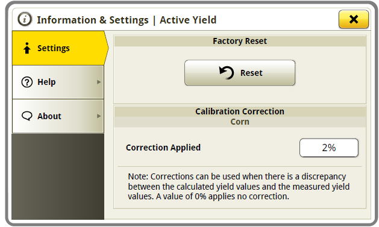

# Facteur de correction d'ActiveYield – S700 - 4600

1. Sur l'écran ActiveYield, appuyer sur le bouton **Informations**.

   

2. Sur l'écran **Informations & Settings**, sélectionner le bouton **Calibration Correction**.

   

3. Saisir le pourcentage de correction entre la valeur réelle mesurée et la valeur donnée par la machine, puis
appuyer sur **OK**.

   