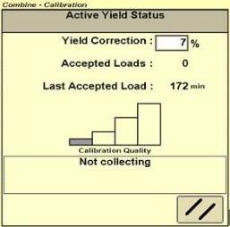
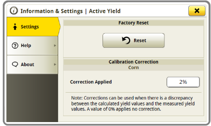

# Facteur de correction du rendement

Comme pour l‘humidité, la différence entre le rendement mesuré par la machine et le rendement réel peu être ajusté par le conducteur.
Veuillez appliquer un facteur de correction que s'il y a plus de 4% de différence.

Conseils pour la correction:
1. Pour un maximum de présicion, moissonner jusqu‘á ce que au moins 15 charges ActiveYield soient acceptées, avec une humidité et
une vitesse de déplacement constantes. Plus le nombre de charges acceptées sera important plus la présicion sera grande. Veiller à ne pas
appliquer de facteur de correction avec moins de 15 charges acceptées, le système deviendrait incohérent en cherchant à modifier
constamment les valeurs.
2. Récolter et peser à la bascule 5 trémies pleines, puis comparer le poids total des 5 chargements au rendement donné par la machine
3. Calculer sous forme de pourcentage la différence entre le poids annoncé par la machine et le poids mesuré à la bascule.
Répéter 3 fois puis saisir la valeur moyenne des 3 pourcentages précédemment calculés.

## S600 - 2630

## s700 - 4600

