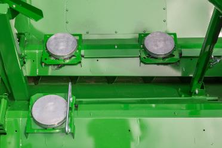
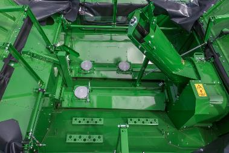

# Fonctionnement

**ActiveYield** assure un calibrage continu du capteur de débit massique via les cellules de charge dans le fond de la trémie à
grain.

Les cellules de charge dans la trémie à grain permettent d'estimer la variation du poids du grain lors du remplissage.

 Le logiciel du contrôleur AYM, associé au capteur d'humidité, compare en temps réel les données recueillies par ces cellules de charge avec celles du capteur de débit massique de l'élévateur à grain. En analysant ces deux sources d'information, le logiciel ajuste automatiquement la courbe de calibrage du capteur de débit massique pour garantir une mesure précise du flux de grain.

