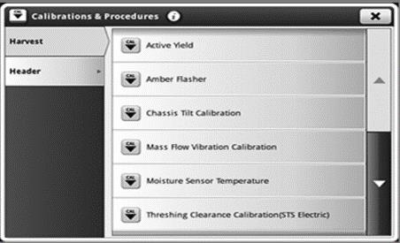
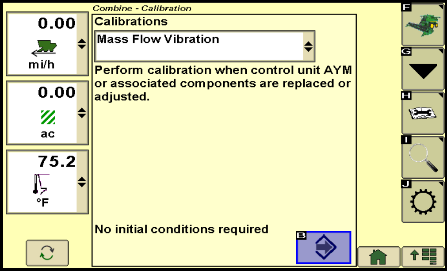

# Fonctionnement d'ActiveYield

1. Effectuer le calibrage de vibration du capteur de débit massique avec l'unité de récolte attelée et la trémie
à grain vide.
2. Calibrer la température du capteur d'humidité

Ce calibrage de vibration doit être effectué lorsque :
* Le logiciel du contrôleur AYM est mis à jour
* Recommandé à chaque fois que l'unité de récolte est déposée ou reposée. En particulier après le transport sur route.

## S700 - 4600

## S600 - 2630

