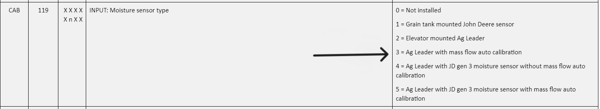

# Kit de rééquipement

## Informations complémentaires 

**Note** : Les mises à jour des logiciels AYM et PDU de l'unité de contrôle sont nécessaires pour compléter l'installation d'ActiveYield™.
Voir la solution 109573 du Centre d'assistance technique des concessionnaires (DTAC) pour de plus amples informations.

L'écran GreenStar™ 2 2600 n'est pas compatible avec le système ActiveYield™.

L'installation du système nécessite également les éléments suivants
* Le logiciel GreenStar™ 3 2630 version 3.28.1186 ou ultérieure via StellarSupportTM le cas échéant.
Pour obtenir le logiciel le plus récent, consulter le site [Stellar Support](https://www.deere.fr/fr/stellar-support/).
* Le récepteur StarFire™ SF3000 ou plus récent doit être installé et le module de compensation de terrain (TCM) calibré.
* Logiciel de l'unité de contrôle du véhicule

## Modification de l'adresse 119 du contrôleur CAB

