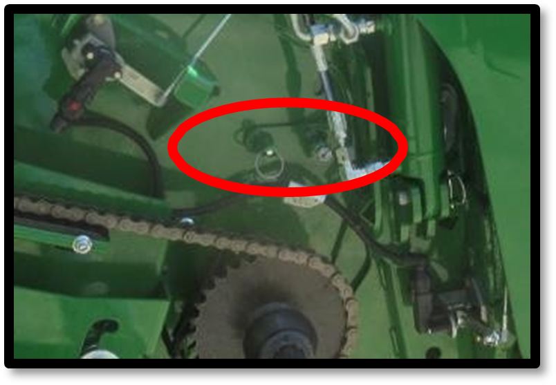
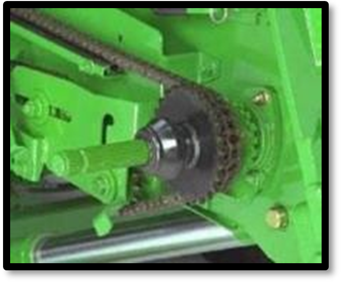
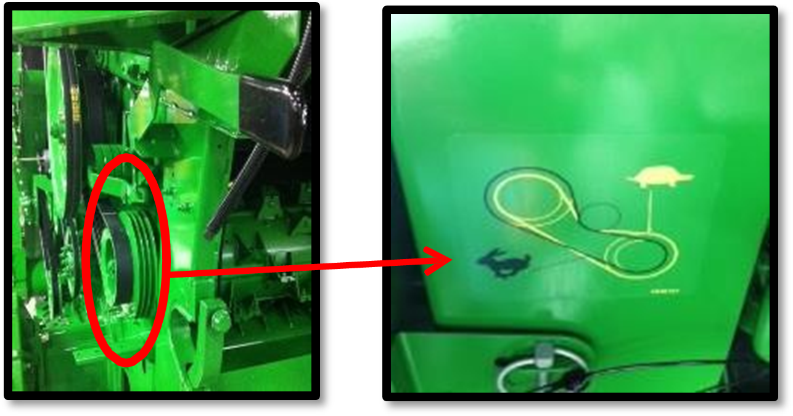

# Réglage et inspection de la moissonneuse-batteuse (à revoir)

## Hauteur et vitesse de la chaîne du tambour du convoyeur d'alimentation

* Position du tambour avant - Poignée vers le bas pour le blé  
* Vitesse de la chaîne du convoyeur : 32 dents pour les conditions de 
récolte de blé normales et difficiles, 26 dents dans des conditions sèches

 

## Vitesse du tambour d‘alimentation 

Dans des conditions normales et difficiles, la vitesse sera rapide.  
Dans des conditions sèches et cassantes, la vitesse peut être abaissée.  
Cela permettra de réduire l’endommagement de la paille et de réduire la charge du caisson.

## Contre-batteurs

Les contre-batteurs à petit fil no 1 et à gros fil no 2 sont recommandés pour les céréales et offrent les meilleures performances. La configuration standard de la machine comporte un contre-batteur à petit fil à l'avant, un contre- batteur à petit fil au milieu et un contre-batteur à grand fil à l'arrière. Dans des conditions de battage difficiles, le contre-batteur du milieu peut être remplacé par un contre-batteur à grand fil pour augmenter le battage.
Les contre-batteurs à mini barre ronde no 3 doivent uniquement être utilisés dans des conditions difficiles lors de bourrages de contre-batteur, et lorsque les réglages machines ne suffisent plus.
Se reporter au livret d'entretien pour la procédure de mise à niveau et le calibrage à zéro des contre-batteurs (de l'avant à l'arrière), ainsi que pour l'écartement par rapport aux éléments de battage.

## Plaques d'obturation du contre-batteur

Des plaques d'obturation de contre-batteur ne seront probablement pas nécessaires en raison des performances de battage élevées du contre- batteur à petit fil et du rotor.
S'ils s'avèrent nécessaires, ils doivent être posés dans l'ordre suivant en raison de la manière dont les retours des otons sont traités. Pour SX60 et SX70, positions 1, 4, 5, 2, 3. De SX80 à SX90, position 1, 2, 3, 4, 5.

## Grilles de séparation

S'assurer que les entretoises de la grille de séparation no 1 se trouvent sur le rail pour l'orge. Cela permettra d’avoir les grilles en position haute, afin d’assurer un flux constant de récolte via les organes de battage. Utiliser les couvercles de grille de séparation no 2 uniquement lorsque la répartition au caisson de nettoyage est inégale. Ils permettent de réduire la quantité de matière sortant du rotor sur l'extérieur. Avant de les poser, tenter d'obtenir une répartition uniforme du caisson de nettoyage en réglant les diviseurs des vis d'alimentation.

## Batteur d'otons et déflecteurs supérieurs réglables (suivant équipement)

Le contre-batteur du batteur d'otons doit être en position fermée (céréales). Si les céréales sont sujet à la “casse”, le contre-batteur peut également fonctionner en position ouverte (maïs).

Les déflecteurs supérieurs du rotor doivent être en position standard. En conditions très sèches ils peuvent être placés en position avancée pour améliorer la qualité de la paille et réduire la charge du caisson.

## Réglages des organes de battage

Le rotor doit être réglé sur un régime rapide.
Régime du rotor – 850 tr/min – Conditions sèches et cassantes
Régime du rotor – 950 tr/min – Conditions normales et difficiles. Écartement du contre-batteur – 25 mm - Conditions de battage sèches et faciles
Écartement du contre-batteur – 15 mm – Conditions normales et difficiles Ces recommandations de réglages constituent un point de départ et devront éventuellement être encore optimisées. Un écartement de contre-batteur allant jusqu'à 30 mm est possible dans des conditions de battage faciles.

# Composants du caisson de nettoyage

La grille à otons universelle no 1 et la grille à grain universelle no 3 sont couramment utilisées. Il est possible de poser une grille à otons hautes performances no 2, qui permet d'obtenir un échantillon de trémie plus propre et une réduction de la charge d'otons lorsque que les performances sont limitées par le caisson de nettoyage

Les diviseurs des vis d'alimentation no 1 doivent être réglés pour obtenir une répartition uniforme du caisson de nettoyage. Le relevage des tôles permet de réduire la quantité de matière à l'extérieur. Il est également possible de poser une pré-grille à otons réglable no 2, qui empêche l'accumulation de tiges dans la grille, lors de la récolte de colza et de tournesol. La pré-grille à ôtons réglable n'offre aucun avantage pour le blé. L'extension de pré-grille à otons no 3, n'est pas livrée avec les machines ZX et ne doit pas être posée pour le blé.

## Régler le caisson de nettoyage

Suivant équipement, la pré-grille à otons réglable doit être réglée sur l'ouverture maximale. 

### Grille à otons

#### Ouverture

|  |  |
|---|---|
| Débit normal  (SX70 à 7 t/ha)| 16 mm |
| Débit élevé  (SX90 à 10 t/ha)| 19 mm |

> **Remarque** :
> L'ouverture de la grille à otons doit être supérieure de 2 mm en cas de pose de la grille à otons hautes performances.

#### Extension

|  |  |
|---|---|
| Terrain plat | 5 mm |
| A flanc de coteau | 10 mm |

### Grille à grains

#### Ouverture

|  |  |
|---|---|
| Débit normal  (SX70 à 7 t/ha)| 6 mm|
| Débit élevé  (SX90 à 10 t/ha)| 8 mm |

> **Remarque** :
> L'ouverture de la grille à grain doit être supérieure de 1 mm en cas de pose de la grille à otons hautes performances.

#### Régime du ventilateur

|  |  |
|---|---|
| Débit normal  (SX70 à 7 t/ha)| 1150 tr/min|
| Débit élevé  (SX90 à 10 t/ha)| 1250 tr/min |

> **Remarque** :
> Le régime du ventilateur doit être supérieur de 100 tr/min avec une grille à otons hautes performances.

## Transporter du grain

Lors du transport, les couvercles de vis transversale doivent être relevés. Pour un niveau d'humidité supérieur à 24 % lors de la récolte, il peut être nécessaire de les abaisser. Le déflecteur au niveau de la vis de remplissage de la trémie à grain peut être réglé pour modifier le chargement de la trémie à grain. La position illustrée permet de charger la trémie à grain plus à droite. 

## Installer les composants du système de résidus

1. Posez les palettes incurvées (1) sur chaque deuxième segment de l'épandeur à disques Advanced PowerCast.
1. Retirez le couvercle situé sous le tambour d'alimentation (2).
1. Placez le ralentisseur de chute (3), en configuration Premium uniquement, afin d'améliorer la formes des andains et accélérer le séchage de la paille.

## Régler les résidus

1. Réglez le régime du broyeur (1) sur **élevé**.
1. Enclenchez les contre-couteaux (2). Une utilisation inadéquate des contre-couteaux peut engendrer une consommation d'énergie inutilie.
1. Posez la barre d'ancrage (3) sur le plancher du broyeur à coupe fine (44 couteux) pour augmenter la qualité du broyage.
1. Réglez le déflecteur de rafles (4) en position relevée/petites céréales.
1. Ajustez les ailettes du déflécteur arrière ou du volet de broyage/andainage (5) pour améliorer la répartition des résidus.

# Conseils et astuces

## Identifier l’origine des pertes 

Déterminez l'origine des pertes pour prendre les mesures adéquates. 
Elles peuvent survenir avant la moisson ou être dues à certaines pièces 
de la moissonneuse. Dans ce cas, vérifiez :
- l'unité de récolte ;
- les organes de battage ;
- le caisson de nettoyage.

## Optimiser l'utilisation du caisson de nettoyage

### Répartir la matière uniformément

Assurez-vous que la répartition de la matière est uniforme sur le
caisson de nettoyage. Si ce n'est pas le cas :

1. Appuyez sur **STOP** pendant la récolte.
1. Ajustez les diviseurs des vis d'alimentation. 
1. Installez des couvercles sur les grilles de séparation 
du contre-batteur.

### Décharger le caisson de nettoyage

En conditions de battage sec et facile, le côté droit du caisson 
de nettoyage peut être surchargé en grains. 
1. Relevez complètement le diviseur droit des vis d'alimentation.
1. Si nécessaire, ajoutez des plaques d’obturation sur le côté 
droit du contre-batteur afin de réduire la charge en menue paille. 
1. Assurez-vous que la grille à otons est suffisamment ouverte.

## Adapter la moissonneuse aux conditions de culture

Évaluez soigneusement le type de culture et les conditions 
avant de commencer la récolte. Pour le blé, tenez compte de la 
capacité de battage, de la rigidité de la paille et de sa teneur 
en humidité, qui influencent les réglages de la moissonneuse.

### Régler les organes de battage pour les cultures difficiles

Les variétés difficiles à battre exigent une configuration agressive
des organes de battage. 
1. Réglez l'écartement du contre-batteur jusqu'à 5 mm.
1. Utilisez des contre-batteurs à petit fil.
1. Installez des plaques d'obturation.

### Ajustez la machine en cas de faible rendement

Pour maintenir la machine chargée :
1. Augmentez la largeur de l'unité de récolte.
1. Augmentez la vitesse de déplacement.

### Gérer le volume et la qualité de la paille

Le volume de paille qui passe par la moissonneuse-batteuse a une
influence considérable sur la productivité.

- Une paille verte et humide rend le battage plus difficile. La base de la tige étant plus humide que le sommet, une coupe trop basse 
augmente la quantité de matière humide à traiter, ce qui peut ralentir 
le débit de céréales.
Ajustez la hauteur de coupe en fonction de l'humidité de la plante.

- Une paille très sèche et cassante peut entraîner une surcharge
du caisson de nettoyage. Pour limiter ce problème : 
1. Ajoutez des plaques d’obturation. 
1. Agrandissez l'écartement du contre-batteur. 
1. Ralentissez le rotor (min. 800 tr/min.

## Vérifier les réglages cabine

Assurez-vous que les réglages en cabine sont précis en contrôlant 
régulièrement que les valeurs affichées en cabine correspondent aux valeurs 
réelles (par exemple, l'ouverture des grilles à otons).