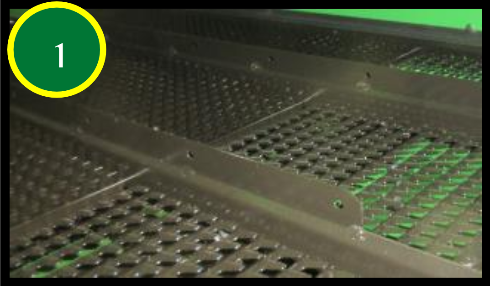

# Composants du caisson de nettoyage

La grille à otons universelle nº 1 

et la grille à grain universelle nº 3 sont
couramment utilisées. Il est possible de poser une grille à otons hautes
performances nº 2, qui permet d'obtenir un échantillon de trémie plus
propre et une réduction de la charge d'otons lorsque que les performances
sont limitées par le caisson de nettoyage.

