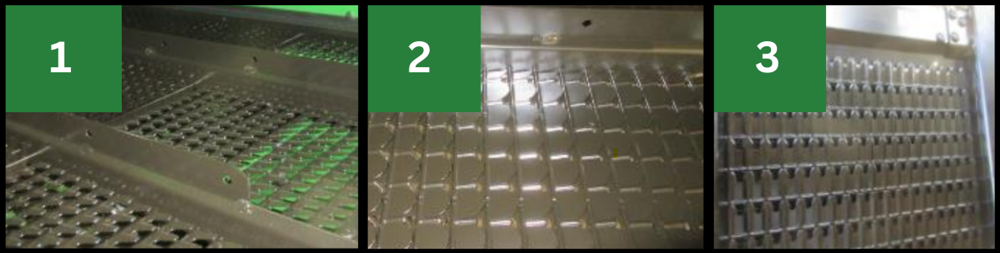
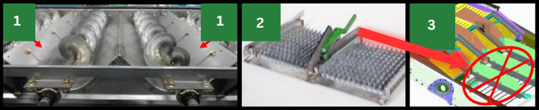

# Composants du caisson de nettoyage

## Grilles

  

| Image  | Description  |   
|---|---|
|1|Grille à otons universelle
|2|Grille à otons haute performance
|3|Grille à grain universelle

Vous pouvez choisir les grilles à utiliser selon vos besoins.
La grille à otons universelle et la grille à grain universelle sont la configuration standard couramment utilisée.

Pour obtenir obtenir un échantillon de trémie plus propre et une réduction de la charge d'otons (lorsque les performances sont limitées par le caisson de nettoyage), utilisez la grille à otons haute performance.

## Diviseurs des vis

  

  <strong>Note : </strong>L'extention de pré-grille ne doit pas être utilisée pour le colza.

|Image|Composant|Utilisation|
|---|---|---|
|1|Diviseurs des vis d'alimentation | À règler pour obtenir une répartition uniforme du caisson de nettoyage.|
|2|Pré-grille à otons réglable | Récolte colza et tournesol : Empêche l'accumulation de tiges dans la grille.|
|3|Extension de pré-grille à otons (pas livrée avec les modèles ZX | Récolte tournesol et orge.|