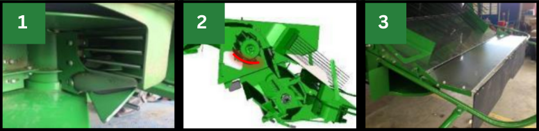

# Composants du système de résidus

  

|Image|Composant|Utilisation|
|---|---|---|
|1|Palettes incurvées|À poser sur chaque deuxième segment de l'épandeur à disques Advanced PowerCast.|
|2|Couvercle sous le tambour d'alimentation|<strong>Ne doit pas être posé : risque d'enroulement lors de la récolte de petites céréales.</strong>|
|3|Ralentisseur de chute|Pour la configuration Premium afin d'améliorer la forme des andains et accélérer le séchage de paille.|
