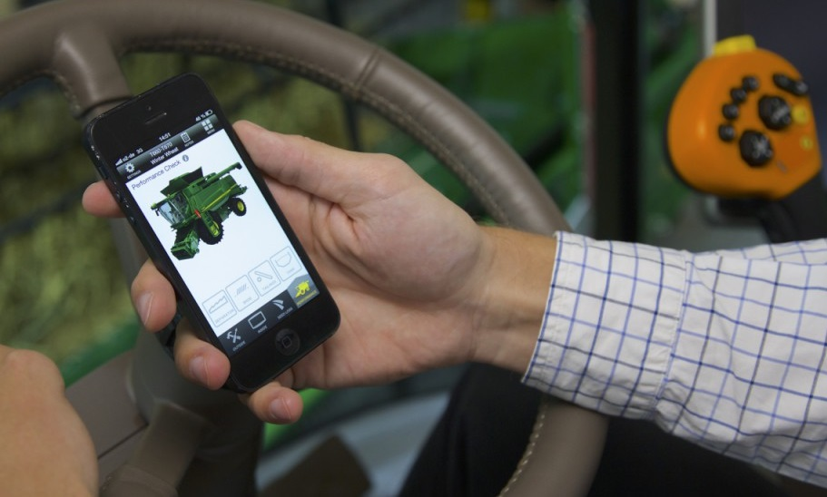
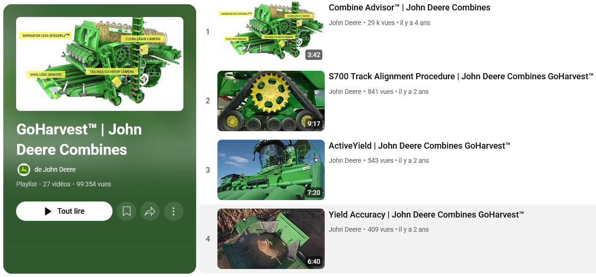

# Ressources

## Application GoHarvest

Pour aller plus loin dans l'optimisation de vos réglages, téléchargez l'application GoHarvest. Elle vous offre un ensemble d’outils utiles au quotidien :

* Un assistant de réglages pour différents types de récolte.
* Un calculateur de pertes pour affiner vos ajustements.
* L’accès direct à JDParts pour identifier les pièces nécessaires.
* Des vidéos tutoriels et procédures détaillées pour chaque étape.
* Des conseils personnalisés selon votre modèle de machine.

  Disponible gratuitement sur iOS et Android.

  

## Chaine Youtube John Deere - GoHarvest

Par ici : [https://www.youtube.com/playlist?list=PL1KGsSJ4CWk7jzH744F1bByhwXWAlxmFj](https://www.youtube.com/playlist?list=PL1KGsSJ4CWk7jzH744F1bByhwXWAlxmFj)

Trouvez des vidéos explicatives pour vous accompagner dans l'utilisation et les réglages de votre moissonneuse-batteuse :

* La procédure complète d’arrêt en pleine récolte (STOP machine).
* L’utilisation de CombineAdvisor™.
* Les réglages automatiques avec Active Terrain Adjustment
* Et bien d'autres fonctionnalités avancées

  Accédez directement à la chaîne pour un accompagnement visuel, clair et rapide.

  

