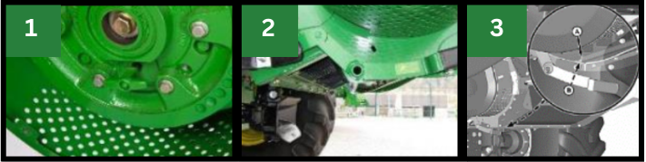
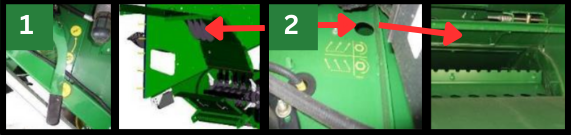

# Réglages des résidus

## Régime du broyeur

  

|Image|Composant|Réglage|
|---|---|---|
|1|Régime du broyeur|Élevé|
|2|Contre-couteaux|À enclencher uniquement en cas de besoin pour éviter une consommation d'énergie inutile.|
|3|Barre d'ancrage|À poser sur le plancher du broyeur à coupe fine pour augmenter la qualité du broyage.|

## Déflecteur de rafles

  

|Image|Composant|Réglage|
|---|---|---|
|1|Déflecteur de rafles|Position relevée|
|2|Ailettes du déflecteur arrière ou du volet de broyage|À ajuster pour améliorer la répartition des résidus.|

