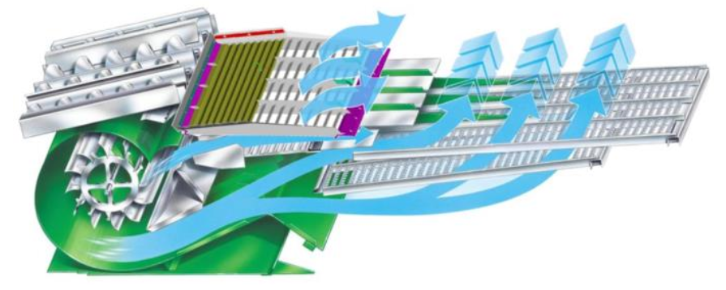

# Réglages du caisson de nettoyage

  

|Réglage|Valeur|Débit|Conditions supplémentaires|
|---|---|---|---|
|Ouverture de la grille à otons universelle|11 mm|Normal|(SX70 à 3,5 t/ha)|
|Ouverture de la grille à otons universelle|13 mm|Élevé|(SX90 à 4 t/ha)|
|Écart d'ouverture pour grille haute performance|+2 mm|-|-|
|Extension de la grille à otons|5 mm|Terrain plat|-|
|Extension de la grille à otons|10 mm|Flanc de coteau|-|
|Ouverture de la grille à grain|3 mm|Normal|(SX70 à 3,5 t/ha)|
|Ouverture de la grille à grain|4 mm|Élevé|(SX90 à 4 t/ha)|
|Écart d'ouverture pour grille à grain haute performance|+1 mm|-|-|
|Régime du ventilateur|700 tr/min|Normal|(SX70 à 3,5 t/ha)|
|Régime du ventilateur|800 tr/min|Elevé|(SX90 à 4 t/ha)|
|Écart de régime avec grille haute performance|+100 tr/min|-|-|
|Réglage de la pré-grille à otons réglable|6 mm|-Selon équipement utilisé||