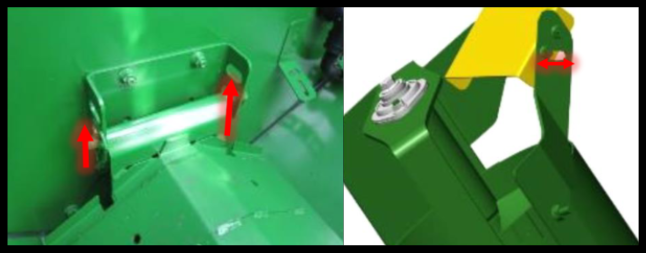

# Transport du grain

  

  <strong>Note : </strong>Les couvercles de vis transversale doivent être en position relevée lors du transport du grain.

Le déflecteur situé au niveau de la vis de remplissage de la trémie à grain peut être ajusté afin d’optimiser la répartition du produit dans la trémie ou pour adapter le chargement selon vos besoins.

Par exemple, la position illustrée permet un chargement orienté vers la droite de la trémie à grain.