##  Composants du caisson de nettoyage

La grille à otons universelle et la grille à grain universelle sont les plus couramment utilisées.

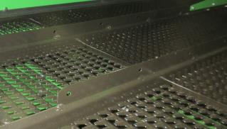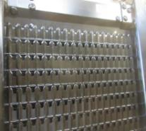

Pour obtenir un échantillon de trémie plus propre et réduire la charge d’ôtons utilisez une grille à otons hautes performances.

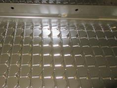

Les diviseurs des vis d'alimentation doivent être réglés pour obtenir une répartition uniforme du caisson de nettoyage. 

Le relevage des tôles permet de réduire la quantité de matière à l'extérieur. 

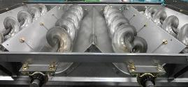

Il est possible de poser une pré-grille à otons réglable pour empêcher l'accumulation de tiges dans la grille. Le résultat obtenue dépend des conditions.

Attention : Ne pas utliser l'extension de pré-grille sur la récolte de tournesol. 

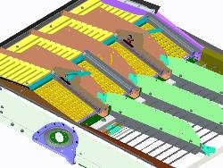

## Réglages du caisson de nettoyage

Le tableau ci-dessous présente les réglages recommandés selon le débit souhaité :

| Élément                        | Débit normal (SX70 – 6 t/ha) | Débit élevé (SX90 – 8 t/ha) | Remarques                                      |
|-----------------------------------|----------------------------------|----------------------------------|----------------------------------------------------|
| Ouverture de la grille à ôtons    | 16 mm                            | 18 mm                            | Ajouter +2 mm avec la grille hautes performances   |
| Extension de la grille à ôtons    | 5 mm                             | 10 mm *(en pente)*              | Pour terrain plat ou en coteau                     |
| Ouverture de la grille à grain    | 6 mm                             | 9 mm                             | Ajouter +1 mm avec la grille hautes performances   |
| Régime du ventilateur             | 950 tr/min                       | 1050 tr/min                      | Ajouter +100 tr/min avec la grille hautes perfs    |
| Réglage de la pré-grille à ôtons  | —                                | —                                | Ouvrir au maximum si présente                      |

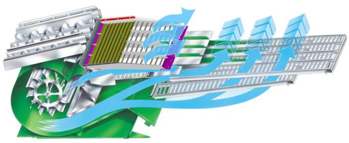

## Transport du grain

Les couvercles de vis transversale doivent être maintenus en position relevée pour la plupart des conditions de récolte.

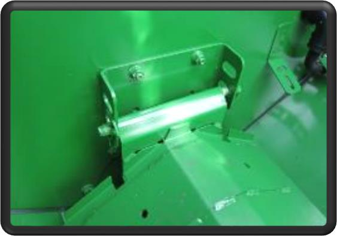

Le déflecteur situé au niveau de la vis de remplissage de la trémie à grain est ajustable. Ce réglage permet de modifier la distribution du grain dans la trémie. Lorsque le déflecteur est positionné comme illustré, il dirige le chargement de la trémie à grain davantage vers la droite.

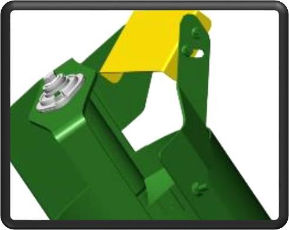

## Composants du système de résidus

Les palettes incurvées doivent être installées sur un segment sur deux de l'épandeur à disques. Cette disposition assure une répartition uniforme des résidus.

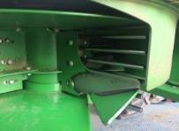

Le couvercle sous le tambour d'alimentation doit être retiré lors de la récolte de petites céréales pour éviter les enroulements.

Pour la configuration Premium, un ralentisseur de chute est disponible. Il améliore la forme des andains et favorise un séchage plus rapide de la paille.

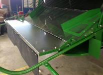

##  Réglages des résidus

Réglez le régime du broyeur sur élevé. Enclenchez les contre-couteaux uniquement si nécessaire pour économiser l'énergie.

Pour augmenter la qualité du broyage, posez une barre d'ancrage sur le plancher du broyeur à coupe fine (44 couteaux).

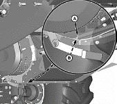

Positionnez le déflecteur de rafles en position relevée pour les petites céréales. Pour optimiser la répartition des résidus, ajustez les ailettes du déflecteur arrière ou du volet de broyage.

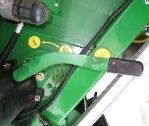
