# Réglage et inspection de la moissonneuse-batteuse

## Hauteur et vitesse de la chaîne du tambour du convoyeur d'alimentation

- Position du tambour avant : Poignée vers le haut pour les tournesols
- Vitesse du convoyeur d'alimentation : 26 dents pour les tournesols.

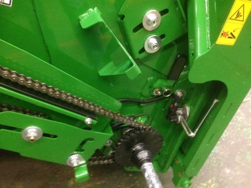

## Vitesse du tambour d‘alimentation

Basse (550 tr/min) pour les conditions normales et difficiles. 

Dans des conditions sèches et cassantes, la vitesse peut être abaissée à 320 tr/min en installant le kit BXE10741 (320 tr/min/770 tr/min). 

<<<<<<< Updated upstream
Cela permettra de réduire
l’endommagement de la paille et de réduire la charge du caisson. Dans les
conditions sèches, le pignon à 770 tr/min du kit BXE10741 peut ensuite être
utilisé pour les petites céréales.

## Contre-batteurs

En cas de conditions de battage difficiles, placez 3 contre-batteurs à grand fil.

En cas de conditions de battage simple, il est possible d'utiliser 3 contre-batteurs à barre ronde, car le battage ne pose généralement pas de problème pour les tournesols.

Voir le livre d'entretien /lien interne/, pour la procédure de mise à niveau et le calibrage à zéro des contre-batteurs (de l'avant à l'arrière), ainsi que pour l'écartement par rapport aux éléments de battage.

## Plaques d'obturation du contre-batteur

Les plaques d'obturation du contre-batteur permettent de réduire la quantité de matière se dirigeant vers le caisson de nettoyage ou d’influencer la répartition sur le caisson de nettoyage et la vis d’alimentation.

En cas d'utilisation de contre-batteurs à grand fil, utilisez les plaques plaques d'obturation du contre-batteur (BH84534). Celles ci permettent de régler avec précision la distribution sur le caisson de nettoyage.

En cas d'utilisation de contre-batteurs à barre ronde, utilisez les plaques d'obturation du contre-batteur (BH84535)

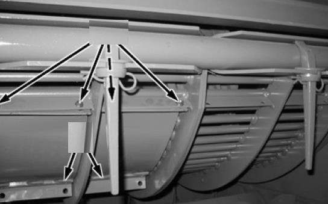

## Grilles de séparation

Assurez vous que les entretoises de la grille de séparation nº 1 se trouvent sur le rail pour le tournesol. Cela permettra d’avoir les grilles en position haute, afin d’assurer un flux constant de récolte via les organes de battage.

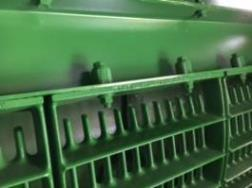

Utilisez les couvercles de grille de séparation uniquement lorsque la répartition au caisson de nettoyage est inégale. Ils permettent de réduire la quantité de matière sortant du rotor sur l'extérieur et donc de réduire la charge de matière au caisson.

## Batteur d'otons et déflecteurs supérieurs réglables

Les déflecteurs supérieurs du rotor doivent être en position standard.

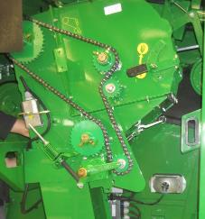

Il est possible de les placer en position avancée uniquement pour tenter de réduire la quantité de matière sur le caisson de nettoyage.

## Réglages des organes de battage

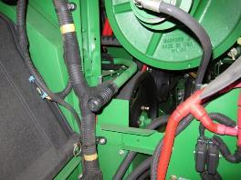   

Le rotor doit être réglé sur un régime rapide.

| Réglage  |Icone| Régime | Condition |
|--------- |:---:|:------:|:---------:|
|Régime du rotor||500 tr/min|Conditions sèches et cassantes|
|Écartement du contre-batteur||30 mm|Conditions de battage sèches et   faciles|

Ces recommandations de réglages constituent un point de départ  mais elles peuvent être optimisés. 
Un écartement de contre-batteur allant jusqu'à 40 mm est possible dans des conditions de battage faciles.

## Composants du caisson de nettoyage

La grille à otons universelle et la grille à grain universelle sont les plus couramment utilisées.

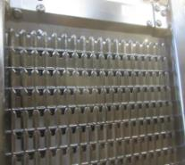

Cela permettra de réduire l’endommagement de la paille et de réduire la charge du caisson. Dans les conditions sèches, le pignon à 770 tr/min du kit BXE10741 peut ensuite être utilisé pour les petites céréales.

Les diviseurs des vis d'alimentation doivent être réglés pour obtenir une répartition uniforme du caisson de nettoyage. 

Le relevage des tôles permet de réduire la quantité de matière à l'extérieur. 

Il est possible de poser une pré-grille à otons réglable pour empêcher l'accumulation de tiges dans la grille. Le résultat obtenue dépend des conditions.

Attention : Ne pas utliser l'extension de pré-grille sur la récolte de tournesol. 

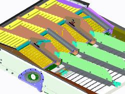

## Réglage du caisson 

|  Élément | Réglage standard  | Réglage haute performance  |
|---|---|---|
|Ouverture de la grille à otons | 14 mm|16 mm|
|Extension de la grille à otons| 0 mm|  0mm |
|Ouverture de la grille à grain |5 mm   |6 mm   |
|Régime du ventilateur |780 tr/min   |Optimiser et augmenter  |

Les réglages haute performance s'appliquent lors de l'utilisation d'une grille à otons ou à grain hautes performances.

Ajustez le régime du ventilateur selon les conditions de récolte avec la grille haute performance.

La pré-grille à otons réglable doit être réglée à 6 mm si elle est équipée. 

L'utilisation du système Active Terrain Adjustment est recommandée, même sur terrain légèrement vallonné, pour optimiser l'échantillon de trémie et gérer le volume d'otons.

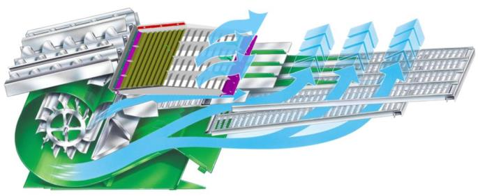

## Transport du grain

Les couvercles de vis transversale doivent être maintenus en position relevée pour la plupart des conditions de récolte.

Le déflecteur situé au niveau de la vis de remplissage de la trémie à grain est ajustable. Ce réglage permet de modifier la distribution du grain dans la trémie. Lorsque le déflecteur est positionné comme illustré, il dirige le chargement de la trémie à grain davantage vers la droite.

## Composants du système de résidus

Les palettes incurvées doivent être installées sur un segment sur deux de l'épandeur à disques. Cette disposition assure une répartition uniforme des résidus.

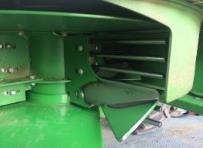

Le couvercle sous le tambour d'alimentation doit être retiré lors de la récolte de petites céréales pour éviter les enroulements.

Pour la configuration Premium, un ralentisseur de chute est disponible. Il améliore la forme des andains et favorise un séchage plus rapide de la paille.

## Réglages des résidus

Réglez le régime du broyeur sur élevé. Enclenchez les contre-couteaux uniquement si nécessaire pour économiser l'énergie.

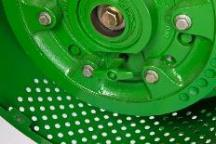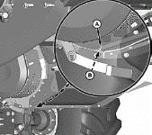

Positionnez le déflecteur de rafles en position relevée pour les petites céréales. Pour optimiser la répartition des résidus, ajustez les ailettes du déflecteur arrière ou du volet de broyage.

