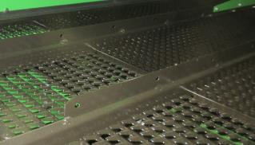
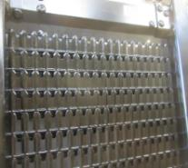
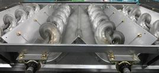
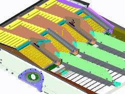

# Régler les composants du caisson de nettoyage
La grille à otons universelle et la grille à grain universelle sont les plus couramment utilisées.

Cela permettra de réduire l’endommagement de la paille et de réduire la charge du caisson. Dans les conditions sèches, le pignon à 770 tr/min du kit BXE10741 peut ensuite être utilisé pour les petites céréales.

Les diviseurs des vis d'alimentation doivent être réglés pour obtenir une répartition uniforme du caisson de nettoyage. 

Le relevage des tôles permet de réduire la quantité de matière à l'extérieur. 

Il est possible de poser une pré-grille à otons réglable pour empêcher l'accumulation de tiges dans la grille. Le résultat obtenue dépend des conditions.

Attention : Ne pas utliser l'extension de pré-grille sur la récolte de tournesol. 

