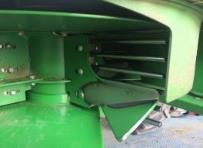
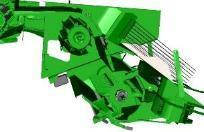
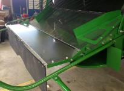

# Régler les composants du système de résidus
Les palettes incurvées doivent être installées sur un segment sur deux de l'épandeur à disques. Cette disposition assure une répartition uniforme des résidus.

Le couvercle sous le tambour d'alimentation doit être retiré lors de la récolte de petites céréales pour éviter les enroulements.

Pour la configuration Premium, un ralentisseur de chute est disponible. Il améliore la forme des andains et favorise un séchage plus rapide de la paille.

