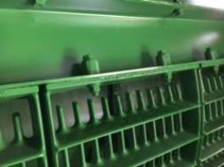
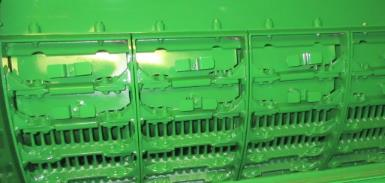

# Grilles de séparation
Assurez vous que les entretoises de la grille de séparation nº 1 se trouvent sur le rail pour le tournesol. Cela permettra d’avoir les grilles en position haute, afin d’assurer un flux constant de récolte via les organes de battage.

Lorsque la répartition de la matière sur le caisson de nettoyage est inégale :
1. Arrêtez immédiatement le véhicule.
2. Évaluez la répartition de la matière.
3. Réglez les diviseurs des vis d'alimentation.
4. Installez les couvercles sur les grilles de séparation du contrebatteur.

Ces deux réglages permettent de réduire la quantité de matière sortant du rotor sur l'extérieur, ce qui réduit la charge de matière au caisson.

