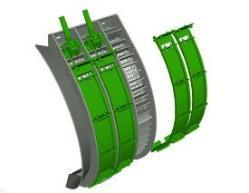

# Régler les plaques d'obturation du contre-batteur
Les plaques d'obturation du contre-batteur permettent de réduire la quantité de matière se dirigeant vers le caisson de nettoyage ou d’influencer la répartition sur le caisson de nettoyage et la vis d’alimentation.

En cas d'utilisation de contre-batteurs à grand fil, utilisez les plaques plaques d'obturation du contre-batteur (BH84534). Celles ci permettent de régler avec précision la distribution sur le caisson de nettoyage.

En cas d'utilisation de contre-batteurs à barre ronde, utilisez les plaques d'obturation du contre-batteur (BH84535)

