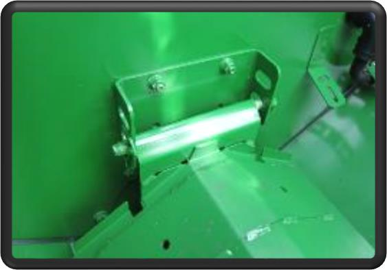
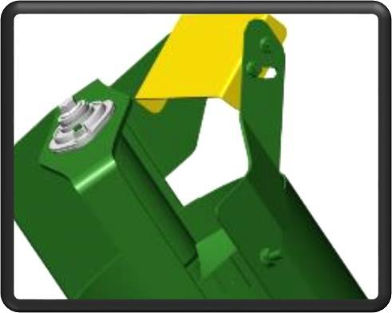

# Transport du grain
Les couvercles de vis transversale doivent être maintenus en position relevée pour la plupart des conditions de récolte.

Le déflecteur situé au niveau de la vis de remplissage de la trémie à grain est ajustable. Ce réglage permet de modifier la distribution du grain dans la trémie. Lorsque le déflecteur est positionné comme illustré, il dirige le chargement de la trémie à grain davantage vers la droite.

