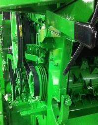

# Régler la vitesse du tambour d‘alimentation
Basse (550 tr/min) pour les conditions normales et difficiles. 

Dans des conditions sèches et cassantes, la vitesse peut être abaissée à 320 tr/min en installant le kit BXE10741 (320 tr/min/770 tr/min). 

<<<<<<< Updated upstream
Cela permettra de réduire
l’endommagement de la paille et de réduire la charge du caisson. Dans les
conditions sèches, le pignon à 770 tr/min du kit BXE10741 peut ensuite être
utilisé pour les petites céréales.

