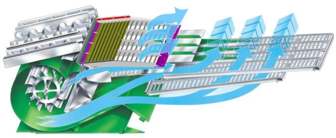

# Réglage du caisson
|  Élément | Réglage standard  | Réglage haute performance  |
|---|---|---|
|Ouverture de la grille à otons | 14 mm|16 mm|
|Extension de la grille à otons| 0 mm|  0mm |
|Ouverture de la grille à grain |5 mm   |6 mm   |
|Régime du ventilateur |780 tr/min   |Optimiser et augmenter  |

Les réglages haute performance s'appliquent lors de l'utilisation d'une grille à otons ou à grain hautes performances.

Ajustez le régime du ventilateur selon les conditions de récolte avec la grille haute performance.

La pré-grille à otons réglable doit être réglée à 6 mm si elle est équipée. 

L'utilisation du système Active Terrain Adjustment est recommandée, même sur terrain légèrement vallonné, pour optimiser l'échantillon de trémie et gérer le volume d'otons.

