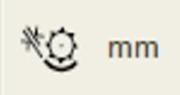

# Régler les organes de battage
   

Le rotor doit être réglé sur un régime rapide.

| Réglage                      |                 Icone                 |   Régime   |                 Condition                 |
| ---------------------------- | :-----------------------------------: | :--------: | :---------------------------------------: |
| Régime du rotor              |  | 500 tr/min |      Conditions sèches et cassantes       |
| Écartement du contre-batteur |  |   30 mm    | Conditions de battage sèches et   faciles |

Ces recommandations de réglages constituent un point de départ  mais elles peuvent être optimisés. 
Un écartement de contre-batteur allant jusqu'à 40 mm est possible dans des conditions de battage faciles.