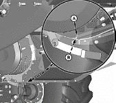
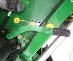
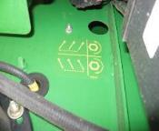

# Régler les résidus
Réglez le régime du broyeur sur élevé. Enclenchez les contre-couteaux uniquement si nécessaire pour économiser l'énergie.

Positionnez le déflecteur de rafles en position relevée pour les petites céréales. Pour optimiser la répartition des résidus, ajustez les ailettes du déflecteur arrière ou du volet de broyage.

