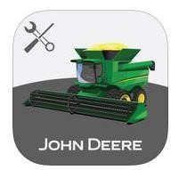
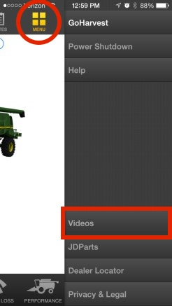

Calibrer votre système
---------

### Accéder aux procédures de calibrage

1. Accédez à l'application mobile ***GoHarvest***.

2. Allez dans **Menu**.

3. Sélectionnez le menu **Vidéos**.
4. Faites défiler les sélections pour trouver la vidéo “Calibrage du rendement”.
   
    La video vous guidera vers les procédures de calibrages. 

### Types de calibrage
Le calibrage permet au système de rester précis et d'assurer la régularité du grain. 
Effectuez un calibrage multipoint au moins une fois par récolte au début de chaque saison.

> [!important]
> Récoltez une trémie pleine pour chaque charge de calibrage.

| Type  | Mode de calibrage| Usage|
| :--------------- | :------------| :-----------|
| Calibrage multipoint | 4 charges différentes recoltées à une vitesse de déplacement variable   |    Conseillé. Utilisez ce mode de calibrage lorsque le rendement de récolte est variable et/ou lorsque la machine est utilisée à des vitesses et des débits variables. Chaque charge est enregistrée avec son débit correspondant. |
| Calibrage à point unique  | 1 charge de calibrage récoltée à une vitesse de déplacement fixe           |   Déconseillé. Utilisez ce mode de calibrage lors des contrôles de précision, lorsque les conditions de récolte évoluent. |

> [!important]
> Si vous ne réalisez pas de calibrage, le système utilise une valeur de calibrage interne définie qui n'est pas adaptée à vos conditions de récolte. La précision diminuera avec l'usure des composants de la moissonneuse-batteuse.