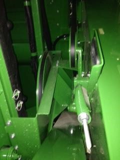
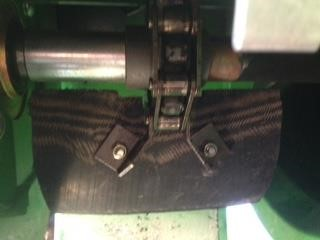
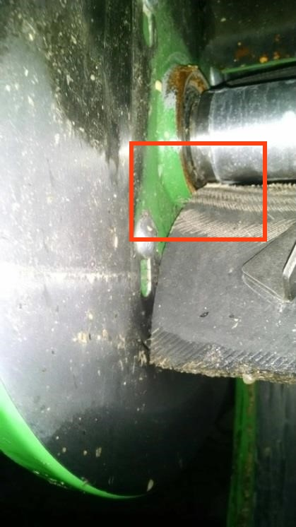
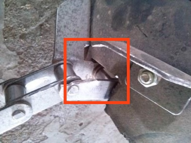

Contrôler la chaîne de l'élévateur à grain
----------------------------------------------
Pour contrôler la chaîne de l'élévateur à grains :
1. Desserrez le tendeur de la courroie d'entraînement de l'élévateur à grain.

2. Ouvrez la trappe inférieure de l'élévateur à grain.

3. Tirez lentement sur la courroie d'entraînement ou sur la chaîne pour faire tourner l'élévateur.
4. Tout en faisant tourner l’élévateur, inspectez soigneusement les maillons de palette et la chaîne de l'élévateur. 

5. Recherchez toute interférence ou tout frottement des palettes sur le carter et sur les flasques de roulement. (Fig. 1) 
6. Contrôlez le bon état des maillons de chaîne et des pattes de fixation des palettes. (Fig. 2)
7. Assurez-vous que toutes les palettes en caoutchouc sont présentes, serrées et en bon état. 

    Les palettes usées ou abimées peuvent affecter la précision du système.

8. Contrôlez la tension de la chaîne, répétez ce contrôle chaque semaine.  
   
   Une chaîne trop lâche : 
   - entraîne le repliement des palettes, 
   - diminue l'efficacité du convoyage des céréales, 
   - diminue la précision du capteur de débit massique. 

 

