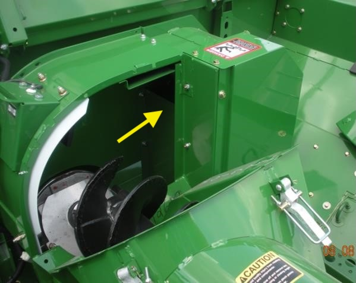
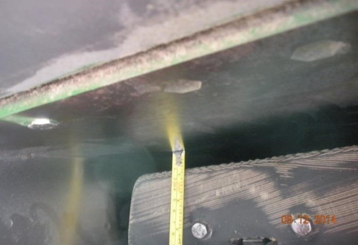

Contrôler l'interstice des palettes élévatrices
----------------------------------
Pour inspecter et corriger l'interstice des palettes élévatrices :
1. Faites tourner la chaîne de l'élévateur à grain jusqu'à ce qu'une palette soit à la verticale en haut du carter de l'élévateur.

  
2. Toujours au même endroit sur chaque palette, mesurez la distance entre l'extrémité de la palette et le carter de l'élévateur. 
3. Si la distance entre la palette et le carter est constamment supérieure à **13 mm (1/2 in)** sur plusieurs palettes, posez le **Kit KXE10374**. 