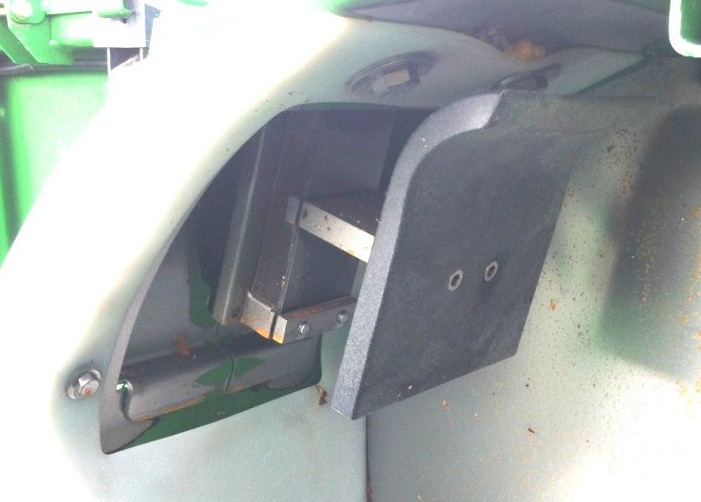

Contrôler la plaque d'impact et capteur de débit massique
---------------------------------------------------------------

Pour contrôler la plaque d'impact et le capteur de débit massique :
1. Inspectez visuellement et nettoyez la zone autour du capteur de débit massique et de la plaque d'impact.

2. Pendant la récolte des cultures, observez l'adresse 95 du contrôleur AYM. 

    L'adresse AYM 95 mesure le débit de céréales.
    La valeur de l'adresse doit être > 0. Plus le débit de céréales est élevé, plus la valeur doit être élevée.

3. Si le débit est de 0 ou ne change pas, consultez les diagnostics du manuel technique du capteur de débit massique. 

 

 

 

 

 

