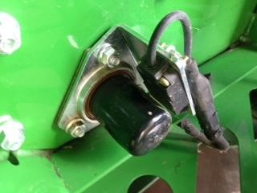

Contrôler la vitesse de l'élévateur à grain
---------------------------------------------------------
Pour contrôler la vitesse de l'élévateur à grain :
1. Enclenchez les organes de battage 
2. Accédez aux adresses de diagnostic.  
3. Accédez à l'adresse 117 du contrôleur AYM.
4. Contrôlez la vitesse de l'élévateur au régime maximum à vide, selon le critère :

| Critère |  Vitesse   |
| :------ | :--------: |
| S660    | 417 tr/min |
| S670    | 417 tr/min |
| S680    | 417 tr/min |
| S690    | 460 tr/min |

5. Si la vitesse est faible, instable ou égale à zéro, contrôlez:
   - le capteur de régime de l'élévateur à grain du côté gauche de la moissonneuse-batteuse,

   - les roulements de l'arbre de la vis d'alimentation. 
 

 

 

 

 

 

 

 

 

 

