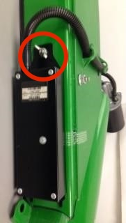
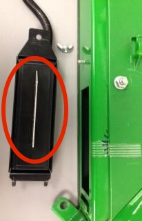

Nettoyer le capteur d'humidité
-------------------------------------------------------

Nettoyez le capteur chaque saison ou plus souvent selon votre utilisation, notamment si les relevés d'humidité sont irréguliers. 

Pour nettoyer le capteur d'humidité :

1. Dévissez l'écrou papillion.

2. Déposez l'ensemble de capteur.
3. Nettoyez la plaque du capteur avec du nettoyant pour vitres et un chiffon humide.

 

 

 

