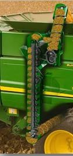
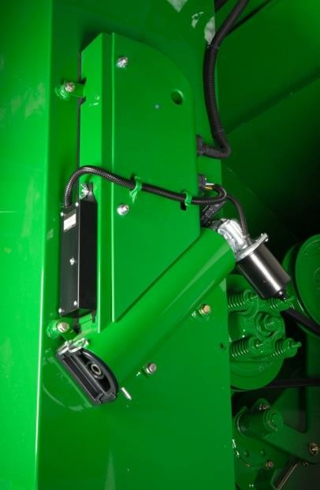
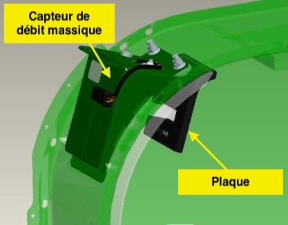
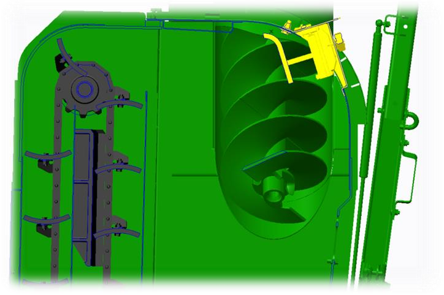

Principe de fonctionnement
---------------------------------------------------------

1. Les grains propres sont transportés par l'élévateur à grain avec une chaîne à palettes. La chaîne à palettes envoie un petit volume de céréales au capteur d'humidité.

1. Le grain tombe des palettes dans le capteur d'humidité, sur le côté supérieur de l'élévateur. Le grain remplit la chambre jusqu’au dessus du capteur d'humidité. 

2. Le taux d'humidité est relevé. Le grain est transporté par la vis sans fin vers le côté retour de l'élévateur.  

3. Lorsque les céréales recouvrent le capteur de proximité, ce dernier active le moteur et la vis d'alimentation pour maintenir un débit continu de céréales à travers le capteur d'humidité.

4. Les céréales sont envoyées vers la partie supérieure de l'élévateur. Leur force d'impact est mesurée par la plaque d'impact du capteur de débit massique placée sur la trajectoire des céréales.  

5. Le volume de céréales passant dans l'élévateur est mesuré par la force de l’impact des grains sur la plaque d'impact du capteur. La force exercée sur la plaque est liée au volume de céréales qui passe à travers les calibrages de l'élévateur à grain. 

6. La vitesse de la chaîne de l'élévateur à grain est mesurée par le capteur de régime. Le débit de céréales (en lb/s ou kg/s) est calculé en combinant le régime de l’élévateur et la force des céréales sur la plaque d'impact. 

7. Cette mesure est enregistrée par le logiciel du contrôleur de la moissonneuse-batteuse. Le débit de céréales, la valeur d'humidité et les données GPS sont enregistrés chaque seconde. Ces valeurs génèrent un point de données sur la carte de rendement. 

 

